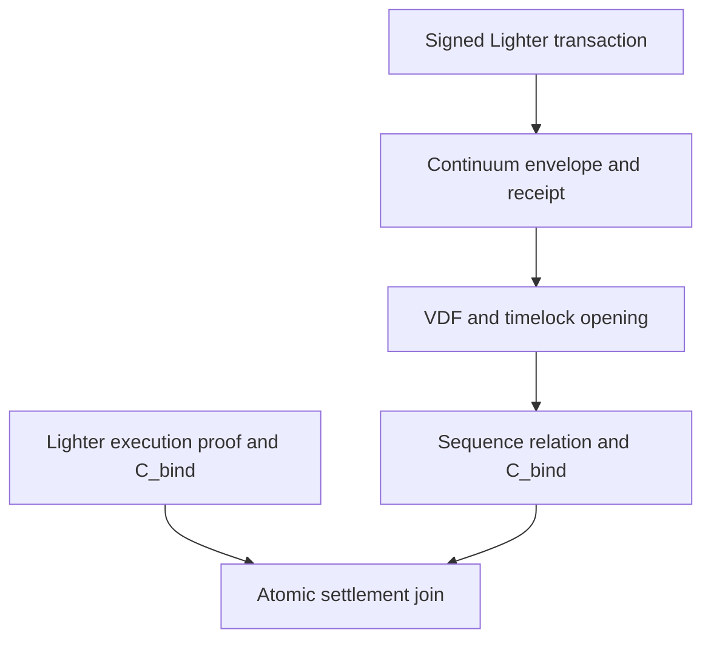

# How the proof-backed Lighter integration works

## Problem and result

A sequencer can see a clear transaction before its execution position becomes binding. This timing can give the sequencer an ordering advantage.

The proof-backed design changes this sequence of events. Continuum fixes the position of an encrypted Lighter transaction before public decryption.

Lighter proves exchange state transitions. Continuum adds encrypted admission and a sequence proof before that execution.

A sequence proof then binds that position to Lighter's execution proof. Atomic settlement advances both state heads or neither state head.

## Main terms

| Term | Meaning |
|---|---|
| Protected transaction | A signed Lighter transaction inside a timelock envelope |
| Receipt | A Continuum signature that fixes an admitted envelope in the protected stream |
| Opening | Public evidence that exposes the envelope after the required sequential work |
| Sequence proof | A proof that derives one complete ordered stream from linked receipts and openings |
| Execution proof | A Lighter proof that applies the ordered stream to the Lighter state |
| `C_bind` | A commitment to both ordered roots, their count, continuity values, and batch context |
| Atomic join | A settlement rule that advances both state heads together |

## 1. Signed and encrypted admission

The user signs a normal Lighter transaction before encryption. This signature keeps Lighter's existing authorization model.

The client places the transaction in a fixed-size envelope. Canonical encoding and padding rules prevent different byte representations of the same logical input.

The solve-only timelock key-encapsulation mechanism (KEM) protects the envelope. ChaCha20-Poly1305 protects payload integrity and binds the associated data.

Each encryption must use unique and high-entropy caller input. Reused or predictable entropy breaks the secrecy boundary.

## 2. Receipt and fixed order

Continuum admits the encrypted envelope without its plaintext. It assigns the next protected position and signs a linked receipt.

The receipt binds the envelope commitment, its position, and transcript continuity. This signature makes the admitted position an accountable obligation.

Receipt issuance must start the required timelock work for that position.

The protected guarantee starts after receipt issuance. The protocol does not prevent rejection or network censorship before that point.

## 3. Timed opening

A verifiable delay function (VDF) proves that a defined amount of sequential computation occurred.

The delay relation uses repeated squaring in an RSA-2048 unknown-order group. Each group value has a fixed encoding of 256 bytes.

Domain-separated hash-to-group binds each VDF use. A streaming-quotient Wesolowski proof verifies the delayed result and its delay parameter.

Anyone can solve a ciphertext and publish an opening. Anyone can verify the opening before they decrypt the payload.

A batch solver executes each required sequential chain on a separate worker thread. It combines the outputs with 128-bit Fiat-Shamir scalars.

The batch solver produces one aggregated Wesolowski proof for each wave. Aggregation reduces proof count and verification work, not sequential solving work.

## 4. Sequence proof

A production sequence proof must cover one contiguous transcript range. It must verify linked receipts, openings, data commitments, cursor continuity, counts, and duplicate rules.

Every protected position must resolve to a Lighter transaction or a proved terminal outcome. `BAD_AEAD` and `BAD_ENCODING` are protected terminal outcomes.

During priority-only recovery, a deterministic `L1_CANCELLED` no-op can resolve only the complete suffix that settlement froze at the fault deadline.

The V3.1 data model creates one rich `DerivedItemV3` leaf and one compact `ExecutionItemV3` leaf for each position.

`ordered_item_root` accumulates the rich leaves. `execution_stream_root` accumulates the compact leaves in the same order.

The sequence proof must verify a one-to-one projection between both roots. It must compute `C_bind` from both roots and the batch context.

`TransitionAuthenticator` defines the authentication boundary for receipt, opening, data, transcript, and frame predicates.

Recursive segment proofs must preserve continuity across long transcript ranges. They keep the external sequence-proof size fixed.

The protocol calls the recursive proof object `SequenceTransitionProof`.

## 5. Lighter execution proof

Lighter executes each clear transaction under its existing rules. These rules cover signatures, nonces, margins, matching, liquidations, and state transitions.

The Lighter circuit must add one field-native Poseidon2 transition for each logical input. It must use Lighter's existing five-field transaction hash.

This accumulator computes the same compact root as the sequence proof. It preserves parallel execution of heavy and light transaction chains.

The validity relation must use a constrained terminal selector for a proved terminal outcome without a Lighter transaction.

## 6. Atomic settlement

The sequence proof and Lighter proof must expose the same `C_bind`. A versioned blob must also bind this value to the Lighter batch.

The atomic join must verify identifiers, state heads, cursor continuity, roots, counts, priority continuity, and blob binding.

Blob validity remains in Lighter's polynomial-commitment verification domain. `C_bind` binds both proof statements to the same versioned blob.

Settlement advances both heads only after both verifier calls succeed. A rejection leaves both heads unchanged.

The host can enter `ZK_FINALIZED` only after this atomic join accepts both proofs.

## 7. Failure and recovery behavior

A missing opening, unavailable receipt data, or solver failure stalls protected finality. None of these failures creates a silent gap.

Only a proved terminal outcome consumes a protected position without execution. This rule prevents an operator from changing a failure into a deletion.

Transcript data loss cannot use recovery cancellation. The proof needs that data to account for every frozen position.

The integration retains Lighter's priority queue and Escape Hatch. A protected service failure can move the system to priority-only operation.

The priority queue supports forced operations. The Escape Hatch keeps asset recovery independent of Continuum liveness.

## 8. Interactive demonstration

The browser demo in `demo/gateway` lets a reader see encrypted admission, signed receipts, timed openings, ordering effects, and fraud evidence.

It drives a simulated Lighter-style price-time order book with bots and scripted scenarios. The browser independently derives signatures, receipt links, roots, and stream commitments.

Optional tooling posts demo anchors and spans to Sepolia. The Solidity demo covers segment-proof verification, bridge commitments, forced inclusion, and optimistic slashing.

The interactive layer represents its Lighter proof result with an off-chain Boolean. This value is a simple true or false result.

The interactive layer uses a simulated order book to explain the end-to-end flow.

The proof-backed settlement path replaces that Boolean with the sequence and Lighter circuit verifiers described in sections 4 through 6.
