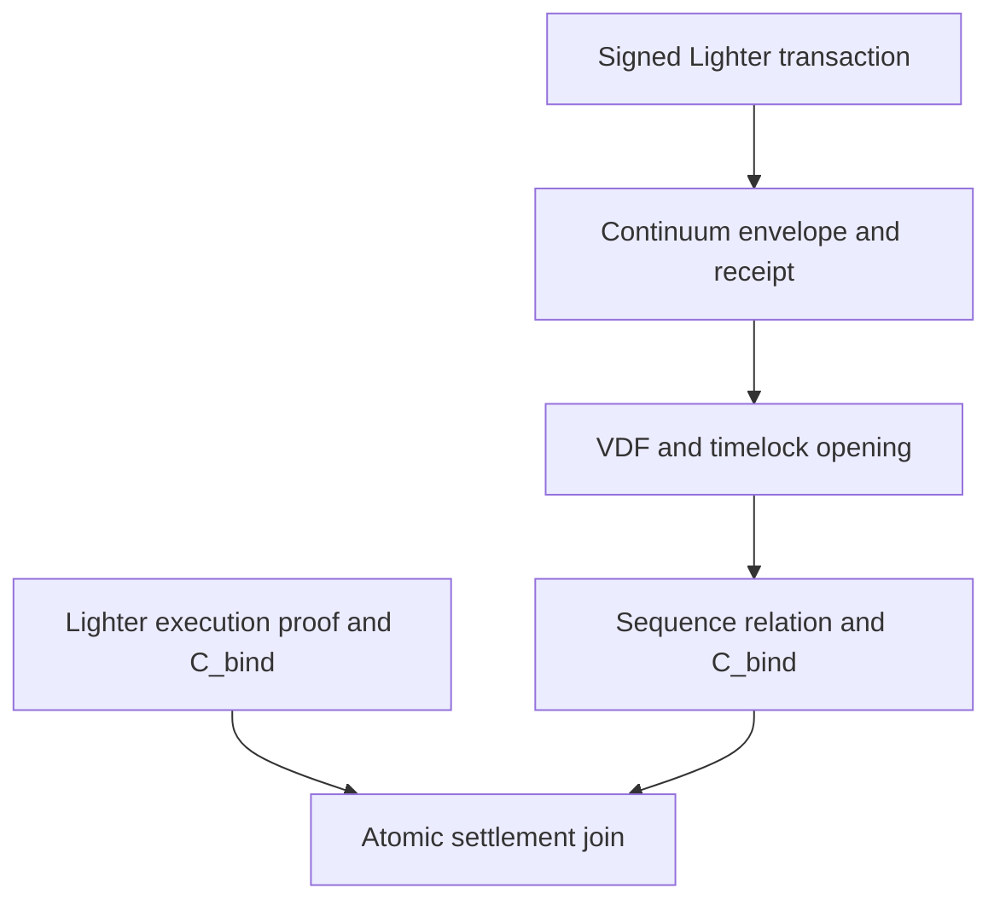

# Full functionality

## System view

The repository combines a runnable V1 bridge with the V3.1 production binding design. The runnable bridge explains behavior. The V3.1 components define the validity boundary.

## Capability status

| Capability | Current repository | Production target |
|---|---|---|
| Demo bridge | Runnable V1 demonstration | Real proof-backed mode |
| VDF and timelock | Functional V1 runtime snapshot | Latest Continuum core, ceremony modulus, and production capacity |
| Timelock batching | Parallel solve chains and one aggregate proof | Amortized sequential work or a documented weaker profile |
| Sequence relation | Host structural verifier | Recursive sequence SNARK |
| Lighter accumulator | Tested native gadget and pinned overlay | Full heavy, light, block, recursion, wrapper, and blob wiring |
| Atomic settlement | Rust relation and Solidity reference | Integration into Lighter's batch lifecycle |
| Cross-system recursion | Design only | Optional measured optimization |
| Data availability | Local content-addressed storage | Durable multi-provider production data availability |
| Tests | Strong extracted team-test suite | Real Lighter witnesses and full proof-pipeline tests |

## 1. VDF and timelock kernel

`crates/vdf/src/posq.rs` contains the core repeated-squaring implementation. It uses an RSA-2048 unknown-order group and fixed 256-byte group encodings.

The module provides domain-separated hash-to-group, tick advancement, streaming-quotient Wesolowski proofs, and proof verification. Tests reject altered outputs, domains, delays, and proofs.

`crates/vdf/src/tlk.rs` contains a solve-only timelock KEM. Delay-class setup adds no new secret.

Production still needs a ceremony-generated modulus with unknown factorization.

Encryption derives the final key from the delayed group result. ChaCha20-Poly1305 protects the payload and binds associated data.

Anyone can solve a ciphertext and publish an opening. Anyone can verify that opening before decrypting the payload.

`crates/vdf/src/batch_solve.rs` solves one maturity wave. It runs each required sequential chain on a separate worker thread.

The module combines the ciphertext bases and solved outputs with 128-bit Fiat-Shamir scalars. It produces one aggregated Wesolowski proof for the wave.

This aggregation reduces proof count and verification work. It does not reduce the sequential solving work for each ciphertext.

The default RSA-2048 modulus has challenge-modulus provenance. Production requires a pinned modulus from an accepted ceremony.

Fresh encryption also requires unique, high-entropy caller input. Reused or predictable entropy breaks the intended secrecy boundary.

## 2. Continuum sequencer runtime

`crates/sequencer` contains the V1 demo sequencer. It provides these functions:

- Fixed-size envelope parsing and padding verification.
- Development admission tickets and one-time ticket consumption.
- Signed receipts, rejections, tick records, segment seals, and anchors.
- Work-defined ticks and asynchronous Wesolowski segment proofs.
- Durable local records and a local content-addressed data store.
- Transcript replay verification and fraud-evidence data types.
- A gRPC service, client, node supervisor, and test helpers.

This runtime supports the self-contained demo. It differs from the V3.1 production target in several important ways.

The runtime starts timelock solving at maturity. V3.1 starts the required work at receipt time.

The V1 path can turn unavailable or invalid items into gaps. V3.1 stalls finality unless a proof establishes a typed terminal outcome.

The local node creates its own wave solutions. It does not verify an adversarial external solver result before applying each witness.

The replay prover emits an optimistic predicate commitment. It does not emit the recursive sequence SNARK required for production.

The data store and entropy sources are suitable for a demo. They are not production data-availability or randomness systems.

## 3. Lighter integration plugin

`crates/continuum-lighter-plugin` contains the standalone V3.1 reference API. It provides these functions:

- Canonical field and byte encodings.
- Rich `DerivedItemV3` leaves for sequence evidence.
- Compact `ExecutionItemV3` leaves for Lighter execution.
- `ordered_item_root` and `execution_stream_root` accumulation.
- Dual-root `C_bind` construction.
- Structural verification for one Continuum sequence transition.
- An atomic Rust join for sequence and execution public inputs.

The structural verifier verifies order, counts, continuity, duplicates, terminal outcomes, both roots, and `C_bind`. It delegates cryptographic predicates to `TransitionAuthenticator`.

That delegation is deliberate host scaffolding. Production must compile receipt, opening, data, transcript, and frame predicates into the proof backend.

The optional `lighter-poseidon2` feature pins Lighter's Plonky2 fork. It generates the exact field-native preimages used by the accumulator design.

The default SHA-256 hasher exists only for deterministic host tests. It is not the Lighter circuit hash.

## 4. Pinned Lighter prover overlay

`patches/lighter-prover` targets one exact Lighter prover revision. The patch adds the direct Poseidon2 accumulator step and a native mutation test.

The accumulator adds one transition for each logical input. It reuses the existing transaction hash and avoids a separate execution-leaf hash.

The overlay does not complete transaction dispatch. Lighter still needs to thread the accumulator through heavy and light paths, `JumpState`, blocks, recursion, batches, and the wrapper.

Lighter also needs a terminal selector and a versioned blob word for `C_bind`. The [upstream integration map](../upstream/lighter-prover-integration-map.md) names each target.

## 5. Settlement reference

`contracts/production/ContinuumLighterBinding.sol` models the atomic two-proof join. It verifies identifiers, state heads, cursor continuity, roots, counts, priority continuity, and blob binding.

The contract updates both heads only after both verifier calls succeed. A revert leaves every head unchanged.

The contract remains a reference scaffold. Its tests use mock verifiers, and it does not replace Lighter's settlement contract.

Production must connect the relation to Lighter custody, KZG verification, batch commitments, governance, verifier upgrades, priority operations, and the Escape Hatch.

## 6. Demo bridge

`demo/gateway` embeds the V1 Continuum sequencer and serves a browser dashboard. It drives a simulated Lighter-style price-time order book with bots and scripted scenarios.

The browser re-derives signatures, receipt links, Merkle roots, and stream commitments. Optional tooling posts demo anchors and spans to Sepolia.

The fraud scenario produces ready-to-submit calldata. The Solidity demo covers segment proof verification, bridge commitments, forced inclusion, and optimistic slashing.

The demo does not execute Lighter's real transaction circuits. Its stream challenge accepts an off-chain Boolean instead of verifying a sequence proof.

Use the demo for behavior review and integration discussion. Do not use it for custody or production settlement.

## 7. Tests and reproducibility

The repository CI separates four test surfaces:

- Stable Rust tests for the plugin, sequencer, VDF, and gateway.
- Exact Poseidon2 tests against the pinned Lighter Plonky2 revision.
- Patch application and compilation against the pinned Lighter prover.
- Foundry tests for the V1 demo and the production settlement reference.

Adversarial tests cover stream mutations, skipped cursors, duplicate receipts, duplicate envelopes, configuration changes, terminal item misuse, and settlement mismatches.

The test suite also covers VDF proof changes, timelock opening changes, aggregate wave changes, transcript faults, and demo contract fraud paths.

See the [team test runbook](./team-test-runbook.md) for exact commands.

## 8. Work that is not present

The repository does not contain a `SequenceTransitionProof` SNARK, recursive sequence aggregation, or a production `ZK_FINALIZED` host state.

It does not contain a complete Lighter heavy and light wrapper proof with `C_bind`. It also lacks real settlement verifier artifacts and production blob binding.

Production data availability, restart recovery, live deployment pins, cross-language vectors, and measured prover overhead remain open.

Cross-system recursion remains optional. The sequence prover still needs internal recursion for scalable spans.
