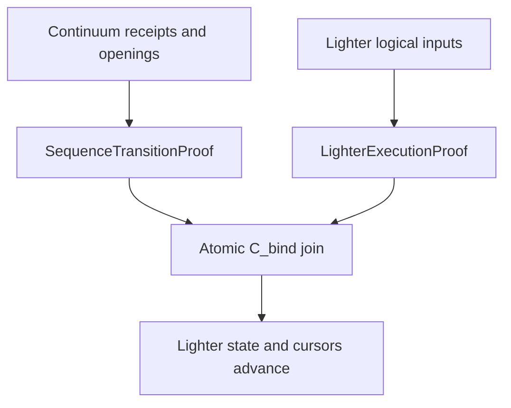

# Lighter integration improvement roadmap

**Review date:** 26 August 2026  
**Repository target:** `Fermi-DEX/lighter-integration`
**Decision:** keep and improve the demo bridge; do not pitch the current code as a production validity integration.

## 1. Executive verdict

There are three different completeness claims, and they should not be collapsed.

| Claim | Current status | Honest description |
|---|---|---|
| Demo bridge | Complete enough to show | A strong, runnable V1 demonstration of blind admission, observable order, browser verification, Sepolia posting, and fraud/slashing paths |
| Production design | Complete for joint review | V3.1 specifies the two proof relations, typed outcomes, dual-root `C_bind`, atomic settlement, failure behavior, recursion policy, and verification matrix |
| Team-test implementation | Ready | Structural sequence verifier, exact pinned Poseidon2 adapter, one-hash Lighter gadget overlay, atomic Rust/Solidity join, and mutation tests are packaged here |
| Production implementation | Incomplete | The recursive sequence SNARK, full Lighter `JumpState`/wrapper/blob wiring, real verifier calls, production DA, and differential/benchmark suite are not complete |

The correct pitch today is therefore:

> Continuum has a concrete Lighter demo and a production-grade integration
> design plus an apply-ready, field-native accumulator overlay. The remaining
> joint work is bounded `JumpState`/wrapper wiring and a recursive sequence
> prover, with explicit negative tests and performance gates.

The incorrect pitch is:

> The bridge already makes Lighter ordering validity-proven, or B3 is a small,
> measured one-Poseidon change.

The demo is useful precisely because it lets the Lighter team inspect the idea
before accepting a circuit change. Its boundary must be stated on the first
screen and in the first paragraph.

## 2. Source-of-truth finding

The prior implementation is split across two Continuum histories:

- `lighter-integration-v1` at
  [`9418a528`](https://github.com/cryptohariseldon/continuum-monorepo/commit/9418a528f09b44cc6705658028f347bf921a9074)
  contains the demo, gateway, Lighter simulator, contracts, scenarios, and V2
  documents.
- Continuum `main` at
  [`83dd6ede`](https://github.com/cryptohariseldon/continuum-monorepo/commit/83dd6edef062157df250462045aad9fc927d4c7a)
  contains nine later sequencing/verifier commits that are absent from the
  demo branch.

The demo branch is therefore the latest Lighter-specific implementation, but
not the latest Continuum production core. This repository preserves the exact
V1 runtime needed by the demo and pins the newer main revision as the
production sequencing baseline. Future production code must be rebased onto
main's fail-closed tape/verifier model rather than extending the old demo
branch in place.

The public Lighter source is also materially clearer than it was when V3 was
written. The reviewed snapshots are pinned in
[`upstream/pins.toml`](./upstream/pins.toml):

- [Lighter prover](https://github.com/elliottech/lighter-prover/tree/8c01ea010d6fd46bdb77ef2f93a79278d1adf0df)
- [Lighter contracts](https://github.com/elliottech/lighter-contracts/tree/e918b1c717776de10640f822edeeb7245f85858a)
- [Lighter's Plonky2 fork](https://github.com/elliottech/plonky2/tree/e1c2d35450948b88fca6a7e69e2643c3ecad3caa)

This resolves much of the architectural uncertainty. It does not identify the
exact live verifier artifacts, governance delays, production configuration,
or transaction-by-transaction failure semantics. Those still need to be
pinned jointly with Lighter.

## 3. Why the demo bridge stays

The demo bridge is not discarded. It has four jobs.

1. It makes the ordering problem and the proposed integration visible.
2. It exercises the gateway, adapter, blind-flow, receipt, anchor, and
   Ethereum-posting surfaces end to end.
3. It demonstrates negative behavior: mutation, reorder, fraud evidence, and
   slashing.
4. It provides a stable harness into which real sequence and execution proofs
   can be substituted incrementally.

The preserved V1 demo includes 44 Solidity test functions and 66 big-integer
`mulmod` vectors, plus the Rust gateway, browser-side verification, bots, and
six scenario families. Historical Sepolia deployment metadata is retained
under `demo/contracts/deployments`. The contracts and any old public URL must
be re-verified before an external demonstration; their presence is not proof
that the deployment is currently live.

### What the demo proves

- A Continuum sequencer can drive a Lighter-style price-time-priority engine.
- Blind, receipted inputs can be ordered and opened deterministically.
- A client can independently recompute the displayed hash-chain and Merkle
  commitments.
- A mismatch can be detected and an optimistic fraud/slashing path exercised.
- Native Wesolowski verification can be demonstrated on Sepolia.

### What it does not prove

- That every accepted Continuum span satisfies the full normative transition
  relation.
- That a Lighter execution proof used the same exact logical stream.
- That the Lighter state root can advance only after both proofs verify.
- That `BAD_AEAD` and `BAD_ENCODING` are circuit-proven terminal no-ops.
- That the current proof design meets Lighter's latency, memory, proof-size,
  or Ethereum-cost budget.

The demo page and its executive brief now carry this boundary explicitly.

## 4. Completeness matrix

| Area | Status | Evidence | Missing production work |
|---|---|---|---|
| Demo UX and scenarios | Done for V1 | `demo/gateway`, browser verifier, bots, scenario runner | Re-run, remove stale endpoints, add real-proof mode |
| Demo bridge contracts | Done for optimistic demo | `demo/contracts`, 44 tests, Sepolia metadata | No execution-proof/state-root binding |
| Canonical production design | Complete for review | `docs/lighter-integration-spec-v3.md`, V3.1 amendments in this roadmap | Freeze cross-team vector IDs and blob version |
| Standalone host plugin | Implemented for team tests | `crates/continuum-lighter-plugin` | Promote reviewed vectors and verifier artifacts to production pins |
| Pinned Poseidon2 adapter | Implemented | `lighter-poseidon2` feature at pinned Plonky2 revision | Cross-check against Lighter CI and deployed artifact revision |
| Atomic two-proof join | Implemented as reference | Rust join API and `contracts/production` reference contract | Integrate real verifier calls into Lighter's batch lifecycle and governance |
| Structural Continuum transition | Implemented for one span | `sequence.rs` and adversarial transition tests | Move all authenticator predicates into the recursive proving backend and persist cross-span state |
| `SequenceTransitionProof` | Designed, not implemented | V3 relation and public inputs | Circuit/zkVM, recursive segment aggregation, verifier artifact |
| Ordered execution binding | Gadget implemented; wiring mapped | Apply-ready pinned overlay and `upstream/lighter-prover-integration-map.md` | Patch heavy/light tx, JumpState, block, recursion, and wrapper circuits |
| Terminal invalid cycles | Designed, not implemented | V3 `BAD_AEAD`/`BAD_ENCODING` semantics | Dedicated no-op selector and exhaustive failure-semantics table |
| Blob binding | Surface exists | 32 reserved bytes at blob offsets 2..33 | Version bump; replace all-zero constraint; bind word to `C_bind` |
| Independent proof settlement | Designed and scaffolded | Equal-`C_bind` relation | Real verifier calls and Lighter batch/state-root integration |
| Recursive cross-system join | Feasible, conditional | Lighter recursive wrapper; OpenVM/Plonky2 precedent | Benchmark and verifier-upgrade design |
| Production DA and recovery | Incomplete | Local demo data and V3 policy | Multi-provider DA, restart persistence, cursor recovery drills |
| Integration and differential tests | Team harness implemented | Demo/Rust/Solidity tests, pinned-overlay CI, end-to-end mutation join | Real Lighter witnesses, cross-language production vectors, adversarial full pipeline |
| Performance evidence | Missing | Lighter benchmark harness exists | Baselines and deltas on the pinned prover commit |

The design and repository are complete enough for joint implementation and
testing with Lighter. They are not complete enough for a production-readiness
or measured-performance claim.

## 5. Production proof boundary

The production system keeps two independent validity statements:



`SequenceTransitionProof` proves that the ordered protected stream is the
unique projection of a valid Continuum state transition. It covers receipts,
positions, duplicate prevention, DA-before-finality, fixed frame plans,
permissionless openings, typed terminal resolution, priority/oracle/protocol
roots, and exact old-to-new continuity.

`LighterExecutionProof` remains the authority for signatures, API nonces,
risk, matching, margin, liquidations, and the Lighter state transition. It also
proves that the logical inputs it consumed match the compact execution stream
committed by Continuum.

Ethereum advances state only if both proofs and the versioned blob agree on
`C_bind`. One proof alone has no settlement effect.

## 6. V3.1 efficiency improvement

The V3 design used one rich `DerivedItemV3` rolling root in both proofs. That
is sound, but it asks Lighter's hot circuit to absorb receipt, envelope, and
opening metadata that it does not otherwise need. The source audit supports a
smaller V3.1 interface with two roots:

- `ordered_item_root`: the rich Continuum root over every
  `DerivedItemV3`; proved only by the sequence proof.
- `execution_stream_root`: a compact root over
  `ExecutionItemV3(index, tx_type, existing_tx_hash, outcome_class,
  terminal_noop)`; computed by both proofs.

The sequence proof proves the one-to-one mapping between the two streams. The
execution proof computes the compact root from the transaction hash and result
already present in its circuit. `C_bind` includes both roots and the shared
count.

This gives the execution prover only the data it needs while retaining
complete receipt/opening accountability in the sequence proof.

### 6.1 Exact, parallel accumulator threading

The reviewed Lighter prover already:

- assigns every active transaction a global `tx_index`;
- proves heavy and light transaction chains separately;
- carries old/new Lighter state and delta roots through `JumpState`;
- commits run boundaries, gaps, coverage, and claims; and
- joins those claims in `BlockCircuit`.

The most efficient exact construction is to add old/new
`execution_stream_root` and logical count to this same transition state.

For each logical input, the optimized V3.1 relation is:

```text
E_0 = H_L(INIT_TAG, domain_hash[8×u32], cursor[2×u32], count[2×u32])
E_{i+1} = H_L(
  STEP_TAG, E_i[4×Goldilocks], i[2×u32], tx_type,
  existing_tx_hash[5×Goldilocks], outcome_class, terminal_noop
)
count       = count + 1
```

The leaf is folded directly into the step preimage. There is no separate leaf
hash, so the hot path is one Poseidon2 permutation-family invocation per
logical item, not two. The existing five-field Lighter transaction hash is
used without byte decomposition. Only the 64-bit logical index is split into
two range-checked 32-bit limbs.

The transaction circuit performs this once. Internal maker matches,
instruction-stack cycles, and other deterministic expansion do not advance it.
Padding does not advance it. The existing heavy/light jump claims stitch the
old/new `E` values exactly as they already stitch Lighter state roots.

This construction:

- preserves heavy/light parallel proving;
- adds no VDF, TLP, RSA, Keccak transcript replay, or receipt verification to
  the transaction circuit;
- avoids a second O(n) merge circuit;
- avoids a new probabilistic multiset/fingerprint soundness argument; and
- makes insertions, deletions, duplicates, and reorders change the final root
  under the existing global-index coverage relation.

The exact code touch points are in
[`upstream/lighter-prover-integration-map.md`](./upstream/lighter-prover-integration-map.md).
The first apply-ready overlay is in
[`patches/lighter-prover`](./patches/lighter-prover).

### 6.2 Terminal inputs

Every receipted Lighter namespace position must appear exactly once.

- A valid cleartext transaction uses the existing Lighter transaction circuit
  and advances the compact accumulator once.
- A state-dependent failure is evaluated by Lighter and advances the
  accumulator once with the proved outcome class.
- `BAD_AEAD` and `BAD_ENCODING` use a dedicated terminal selector. It
  advances `tx_index`, the compact accumulator, and the logical count; it
  leaves Lighter state and API nonce unchanged.
- DA failure, missing opening, or solver timeout has no terminal selector. It
  stalls protected finality.

The terminal circuit is a major correctness item. It is not safe to assume the
current prevalidated transaction pipeline can represent every malformed or
state-invalid input without a transaction-type audit.

### 6.3 Blob and wrapper

The pinned prover defines a 126,976-byte blob. It assigns bytes 0..1 to a
version and bytes 2..33 to a 32-byte reserved area in
[`blob/constants.rs`](https://github.com/elliottech/lighter-prover/blob/8c01ea010d6fd46bdb77ef2f93a79278d1adf0df/circuit/src/blob/constants.rs).
The current wrapper explicitly constrains the version and all reserved bytes
to zero in
[`verify_version_and_reserved_data`](https://github.com/elliottech/lighter-prover/blob/8c01ea010d6fd46bdb77ef2f93a79278d1adf0df/circuit/src/recursion/wrapper_circuit.rs).

The production patch should:

1. introduce a nonzero Continuum binding version;
2. serialize canonical `C_bind` into the existing 32-byte reserved word;
3. prove equality between that word and the execution public input; and
4. retain the existing blob/KZG and batch-commitment checks.

This consumes no additional blob bytes.

## 7. Recursive proof strategy

Recursion has two distinct roles.

### 7.1 Recursion inside the sequence prover: recommended

The sequence relation contains many ticks, receipts, openings, and potentially
expensive time-lock verification. It should be decomposed into parallel leaf
or segment proofs and recursively folded into a fixed-size settlement proof.

A practical hierarchy is:

1. receipt/opening/DA subproofs generated in parallel;
2. segment transition proofs that update persistent Continuum state;
3. a recursive span proof that enforces exact segment continuity; and
4. one Ethereum-verifiable sequence wrapper exposing fixed public inputs.

This is the scalable path. It keeps sequence proving incremental, allows
independent workers, and avoids verifying every VDF segment on Ethereum. The
backend should use Lighter's pinned Goldilocks/Plonky2 family if that is fastest
after big-integer benchmarks. A zkVM or STARK backend is acceptable only behind
a pinned adapter proof with equal public semantics.

Per-item TLP remains capped. Full-scale protected flow requires an aggregate
batch-wave opening module or another opening scheme whose proof and solver
capacity pass adversarial load tests. Recursion reduces proof size; it does
not remove the underlying sequential-work or data-availability requirement.

### 7.2 Recursing the sequence proof into Lighter: optional

Start production testing with independent proofs:

```text
critical path = max(T_sequence, T_execution) + T_contract_join
```

This preserves parallel proving, independent verifier upgrades, and clear
fault isolation.

Lighter's `WrapperInnerCircuit` already verifies eight chain proofs, a
delta-chain proof, and a blob-evaluation proof. Adding one sequence-proof
target is structurally plausible. Axiom has also described adapting OpenVM
extensions to Lighter's Plonky2 stack and recursively aggregating existing
Lighter proofs, which is useful evidence that a narrow adapter is feasible,
not evidence that this exact integration is already complete:
[Axiom's Lighter EVM architecture](https://www.axiom.xyz/blog/lighter-evm).

Adopt the one-proof recursive join only if measurement shows:

- lower total Ethereum verification and calldata cost;
- no unacceptable increase in p95 settlement latency or prover memory;
- sequence and execution proving still run in parallel before final wrapping;
- verifier IDs remain explicit and independently upgradeable; and
- the recursive adapter is pinned and covered by cross-backend vectors.

The security boundary does not depend on cross-system recursion. Equal
`C_bind` and atomic settlement are sufficient. Recursion is a cost
optimization.

## 8. Sequence-prover efficiency rules

The sequence prover is the place for ordering cryptography. The Lighter
transaction circuit is not.

Hard rules:

- Verify RSA/VDF/TLP/opening relations once per sequence span or recursively
  aggregated segment, never once inside each matching circuit.
- Begin time-lock solving at receipt, not at maturity.
- Keep frame cuts, oracle roots, priority ranges, and protocol-event roots
  committed before plaintext opens.
- Carry fixed-size public state between recursive proofs; keep bulk transcript
  and DA data as witnesses with membership proofs.
- Reuse canonical receipt/opening subproofs across re-proving and recovery.
- Parallelize independent opening and receipt checks, then fold only their
  state-transition summaries.
- Use exact length-bound commitments; never duplicate the last Merkle leaf
  without separately binding count.
- Remove `bincode` from every consensus or circuit-facing path.
- A missing opening or DA object stalls the protected cursor. It cannot become
  an omittable gap.

The [official Lighter architecture](https://docs.lighter.xyz/about-lighter/technical-architecture-lighter-core)
describes a custom ZK rollup with execution proven before Ethereum settlement.
The integration should preserve that model and add one validity input, not
replace Lighter's execution authority. Audit artifacts and versions should be
tracked through Lighter's
[security audit index](https://docs.lighter.xyz/security/security-audits).

## 9. Integration test plan

A production claim requires all layers below.

### 9.1 Canonical vectors

Generate one versioned vector corpus consumed by Rust, the sequence circuit,
the Lighter circuit, Go/gnark wrapper code, JavaScript diagnostics, and
Solidity.

Required vectors:

- every `DeploymentDomainV3` field and epoch boundary;
- `DerivedItemV3` for clear, bad-AEAD, bad-encoding, and L1-cancelled items;
- compact `ExecutionItemV3` mapping for every Lighter transaction type;
- field packing at 0, 1, modulus-1, limb, length, and maximum-size boundaries;
- `ordered_item_root`, `execution_stream_root`, and `C_bind`;
- versioned blob header bytes and wrapper public-input serialization;
- all verifier IDs and upgrade-domain changes.

The plugin's SHA-256 vectors are host-test scaffolding only. They must not be
published as production `H_L` vectors.

### 9.2 Stream exactness

For mixed heavy/light streams, prove that all of the following fail:

- insert one input;
- delete the first, middle, or last input;
- duplicate within a span or across adjacent spans;
- reorder adjacent inputs of the same class;
- reorder across heavy/light classes;
- reuse a logical index;
- skip an index while preserving item count;
- mutate tx bytes, tx type, outcome, terminal flag, or cleartext length;
- advance the accumulator for an internal matching cycle; and
- treat padding as a logical input.

Include streams whose last transaction is heavy, light, terminal, or an empty
block boundary. This directly exercises the existing JumpState end-chain
selection.

### 9.3 Transaction and failure semantics

For every current Lighter transaction type:

- compare parser, tx hash, signature, API nonce, expiry, state checks, and
  success/failure code with the production implementation;
- cover grouped orders and multi-cycle matching;
- cover unsigned/L1 and signed/L2 paths;
- cover invalid signature, stale and skipped nonce, insufficient margin,
  market disabled, bad price bounds, reduce-only, slippage, and expiry;
- prove whether each failure consumes an API nonce; and
- prove exactly one compact leaf for both successful and state-invalid inputs.

For `BAD_AEAD` and `BAD_ENCODING`, assert no Lighter state change, no API
nonce change, one logical count increment, and one accumulator transition.

### 9.4 Proof join and contract

Positive test:

- commit one versioned blob and batch;
- verify real `pi_seq` and `pi_exec`;
- check equality of both roots, count, `C_bind`, and blob word;
- advance Lighter root, Continuum cursor/root, namespace count, and priority
  head atomically.

Negative tests independently mutate:

- sequence proof;
- execution proof;
- domain, epoch, verifier ID, old cursor, old transcript root, old state root;
- namespace count and priority range;
- either stream root;
- blob version, blob word, blob versioned hash, or batch commitment; and
- cross-epoch, overlapping, skipped, replayed, and already-consumed batches.

Every negative test must leave all stored heads unchanged.

### 9.5 End-to-end and fault tests

- full shadow feed against a Lighter state replica;
- real Lighter witness generation from Continuum-derived inputs;
- real heavy/light block, segment, batch, wrapper, and Ethereum proof;
- restart at every durable write boundary;
- DA object missing before receipt and after receipt;
- solver crash, slow solver, wrong opening, and malicious opening;
- Continuum outage with priority-only mode and Escape Hatch;
- Lighter prover outage with no cursor advance;
- independent replay from the last jointly finalized head; and
- testnet settlement with contract events and blob retrieval checked by a
  second implementation.

## 10. Benchmark gates

These are acceptance targets, not measured results.

| Metric | Target | Reject or redesign when |
|---|---|---|
| Accumulator frequency | Exactly once per logical input | Any internal matching cycle or padding advances it |
| Execution circuit work | Reuse existing `tx_hash`; one compact stream transition plus minimal packing | Rich receipt/opening metadata enters the tx hot path |
| Heavy/light parallelism | Preserved | One global serial pre-pass becomes the critical path |
| Execution proof p95 wall time | Initial target <=3% regression | >5% without a larger end-to-end cost win |
| Execution peak memory | Initial target <=5% regression | Causes worker-class or concurrency reduction |
| Wrapped proof size | No increase | Public inputs or wrapper proof become batch-size dependent |
| Sequence throughput | >=2x peak protected settlement demand | Queue grows under adversarial maximum supported flow |
| Sequence latency | p99 below the settlement interval with recovery margin | Cursor routinely misses settlement windows |
| Cross-system recursion | Lower amortized gas plus calldata | Higher total cost or material p95 latency increase |
| DA retrieval | p99 within proof-generation budget from at least two providers | One operator is required to prove or recover |
| Recovery | Deterministic replay from last joint head | Manual gap insertion or unprotected downgrade is needed |

Record:

- gate count by circuit and transaction class;
- Poseidon2 permutation count;
- proof generation p50/p95/p99;
- CPU, GPU if used, peak RSS, and serialized proof size;
- wrapper/gnark time;
- Ethereum verification gas and blob/calldata cost; and
- critical-path latency for independent and recursively joined modes.

Use Lighter's existing benchmark pipeline as the baseline on the exact pinned
commit. Do not compare against a different circuit revision or unpinned
hardware profile.

## 11. Implementation phases and exits

### P0 — Repository and interface freeze

- Keep the standalone plugin, V1 demo, V3 spec, source pins, and reference join.
- Freeze `ExecutionItemV3`, the two roots, revised `C_bind`, field packing,
  and blob version.
- Obtain Lighter confirmation of current codecs, failure semantics, live
  verifier artifacts, and upgrade controls.

**Exit:** all host languages agree on canonical preimages and reference
vectors.

**Current:** repository extraction, source pins, V3.1 field preimages, the
exact Rust adapter, and the first pinned prover overlay are complete. Lighter
review of the vector IDs, terminal selector, and blob version is still needed
to close the phase.

### P1 — Sequence validity prototype

- Implement the normative Continuum transition verifier.
- Add durable cursors, duplicate/nullifier state, fixed frame plans, DA
  membership, openings, and typed terminal outcomes.
- Implement recursive segment aggregation and `ZK_FINALIZED` host state.

**Exit:** an independent prover can extend the last accepted head, and every
adversarial stream mutation fails.

### P2 — Lighter prover patch

- Add compact execution leaves to heavy and light transaction paths.
- Thread accumulator state through JumpState, BlockCircuit, recursion, and
  batch public inputs.
- Add the terminal no-op selector.
- Version and bind the blob header word.

**Exit:** the real Lighter wrapper proof exposes the same compact root and
`C_bind` as the sequence proof.

### P3 — Independent two-proof testnet

- Integrate the actual sequence verifier with Lighter's settlement lifecycle.
- Run full transaction/failure differential tests.
- Run the benchmark suite and fault drills.
- Demonstrate atomic testnet settlement.

**Exit:** both proofs and blob are mandatory; no mismatch can advance any
state.

### P4 — Recursive cost study

- Add a narrow recursive sequence-proof target to the wrapper branch.
- Compare gas, calldata, proof latency, memory, and upgrade operations with the
  two-proof path.

**Exit:** adopt recursion only if the measured total is better.

### P5 — Capped protected deployment

- One domain and policy; hard throughput and notional caps.
- Multi-provider DA; monitored proof queues; funded priority/escape paths.
- Drill sequence stall, priority-only, proof failure, recovery, and Escape
  Hatch before raising caps.

**Exit:** sustained operation through proof generation and Ethereum finality
without silent fallback.

## 12. Pitch gate

### Safe to pitch now

- the fairness problem and why it is specifically valuable to Lighter;
- the runnable demo bridge;
- the two-proof architecture;
- the exact low-level prover integration map;
- the apply-ready field-native Poseidon2 accumulator overlay;
- the structural sequence-to-atomic-join negative test harness;
- the fact that expensive ordering cryptography remains outside Lighter's
  transaction hot path; and
- a joint prototype with explicit benchmark and correctness gates.

### Do not claim yet

- production readiness;
- a single recursive proof in production;
- measured “one Poseidon per transaction” overhead;
- exhaustive Lighter transaction/failure coverage;
- live verifier pinning or governance compatibility;
- production DA/liveness; or
- that the historical Sepolia deployment is currently live.

### Minimum material before sending a technical pitch

1. a fresh, reproducible demo run;
2. one canonical vector pack reviewed by both teams;
3. extend the included Lighter gadget overlay into a branch proving the
   compact root for mixed heavy/light transactions;
4. one real sequence-proof prototype, even if only a short span;
5. one negative end-to-end mutation that fails settlement; and
6. baseline versus patched prover numbers.

The repository already moves the pitch beyond “this should be possible”: it
contains the exact hash patch, proof boundary, and host/settlement negative
test. The remaining pitch gate is a real mixed-chain wrapper proof and measured
cost on Lighter hardware.

## 13. Remaining blockers

1. The structural sequence transition is implemented, but its authenticator
   predicates are not yet compiled into a recursive zero-knowledge backend.
2. The current Continuum host does not make `ZK_FINALIZED` proof validity a
   production state-transition condition.
3. Duplicate, receipt-chain, opening, DA, and terminal predicates are checked
   by the team-test relation but are not yet one persistent cross-span proof.
4. The Lighter overlay implements the exact accumulator gadget, but the block
   circuit does not yet carry either Continuum root or `C_bind` through
   `JumpState` and the wrapper.
5. The current wrapper forces the usable blob header bytes to zero.
6. Typed terminal no-ops are absent.
7. The complete Lighter failure-semantics table and exact live circuit/verifier
   pins need joint confirmation.
8. Consensus paths still need versioned, multi-language encoding and vectors.
9. Production DA, restart recovery, solver capacity, and liveness budgets are
   unproven.
10. Neither independent nor recursive proof-join performance has been
    measured.

These are bounded engineering and validation items. They are also real
production blockers. The design should be pitched as a serious integration
proposal only if that distinction remains explicit.
